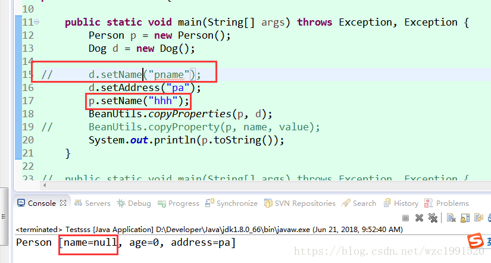
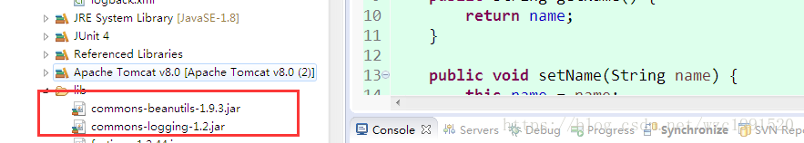

  原文链接：https://blog.csdn.net/wzc1991520/article/details/80176679

谨慎使用这个copyproperties这个功能,相同的属性都会被替换,不管是否有值

  

 BeanUtils 是 Apache commons组件的成员之一，主要用于简化JavaBean封装数据的操作。它可以给JavaBean封装一个字符串数据，也可以将一个表单提交的所有数据封装到JavaBean中。使用第三方工具，需要导入jar包：

BeanUtils工具常用工具类有两个：BeanUtils、ConvertUtils。BeanUtils用于封装数据，ConvertUtils用于处理类型转换，常用API如下

​	

| 对象   | 方法                                       | 描述                                       |
| ---- | ---------------------------------------- | ---------------------------------------- |
|      | populate(Object bean, Map<String,String[]>properties) | 将Map数据封装到指定Javabean中，一般用于将表单的所有数据封装到javabean |
|      | setProperty(Object obj,String name,Object  value) | 设置属性值                                    |
|      | getProperty(Object obj,String name)      | 设置属性值                                    |

定义转换器必须实现Converter接口
将字符串转换为java.sql.Date类型

将类型为Date但值为String的变量的值转换为Date类型  

    功能1：设置属性
    提供一个标准类,有getter,setter构造方法

获取属性

String name = BeanUtils.getProperty(bean, "name");

    封装表单数据，使用Map 模拟request.getParameterMap()

    对象中的属性值对拷

BeanUtils.copyProperties(p,d);

p是等待被赋值的对象,d是源对象,将d中属性值赋值的p中对应的字段,d中有的属性p中必须有,p可以有更多属性

————————————————
版权声明：本文为CSDN博主「大龙成」的原创文章，遵循 CC 4.0 BY-SA 版权协议，转载请附上原文出处链接及本声明。
原文链接：https://blog.csdn.net/wzc1991520/article/details/80176679